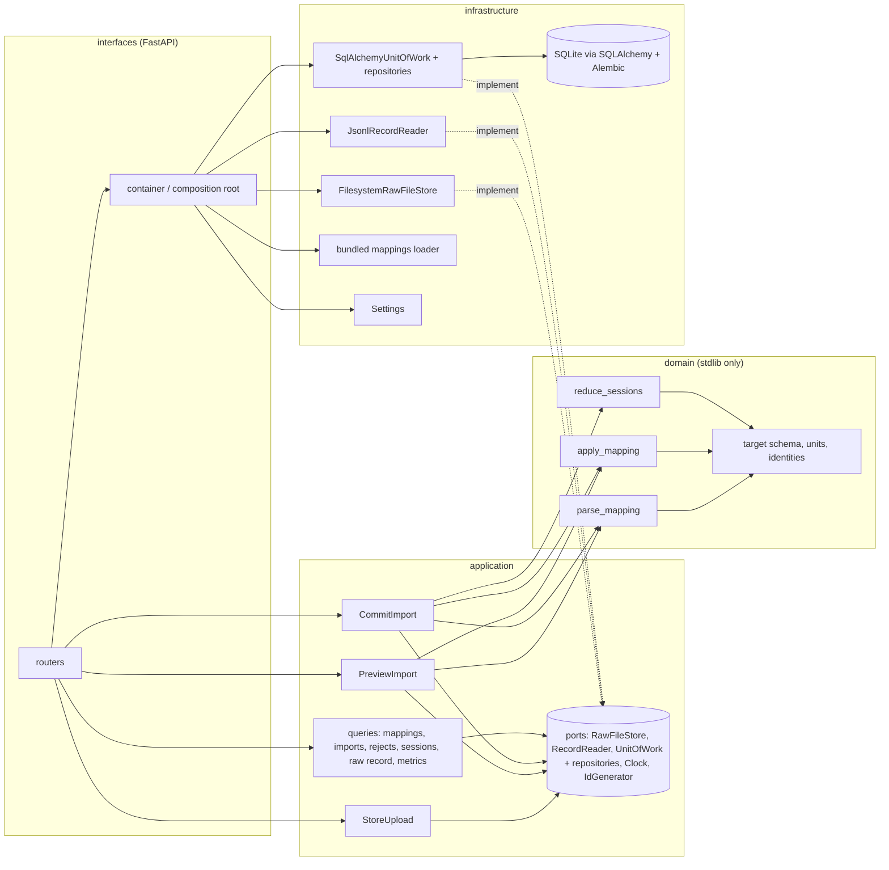

# Import pipeline: components and dependencies

This describes what is running after issues #4, #5 and #6: from an uploaded
file to persisted sessions, model calls and tool calls, and back out through
the HTTP API. Later issues add Parquet, the metric layer, the mapping
assistant and the second source without changing these boundaries.

## Components

Dependencies point inward. `import-linter` fails CI if `domain` imports
anything outside the standard library, if `application` imports an
infrastructure library, or if `infrastructure` imports `interfaces`.

## The commit path

1. `POST /api/uploads` stores the bytes content-addressed (`raw_files`), sniffs
   the format, counts records, keeps a 20-record preview and reports earlier
   committed imports of the same bytes.
2. `POST /api/imports/preview` runs the mapping (parsed by the domain,
   refused with located issues if not executable) over the first N records
   without writing anything.
3. `POST /api/imports` checks exact-file idempotency for the source; if the
   bytes were committed before, it records a `duplicate` attempt and inserts
   nothing. Otherwise it applies the mapping to every record, folds session
   contributions with the domain reducer, and in one transaction writes the
   import row (first as `running`, then finalised), the entities with their
   occurrence keys, the entity contributions (provenance), the per-record
   outcomes with raw payloads, the rejects and the session diagnostics. Any
   failure rolls the transaction back and records a `failed` attempt.
4. Reads go through the same unit of work: sessions with per-session token
   coverage, the session detail with links to raw records, the import
   history and rejects, and the day-1 metrics summary.

## Identity and idempotency in the tables

- `model_calls` and `tool_calls` are unique on `(source, occurrence_key)`,
  where the occurrence key is `sha256:locator:emission_path` (ADR-002).
- `sessions` are unique on `(source, external_id)` and are updated, not
  duplicated, when a later file contributes to the same session.
- `raw_records` are unique on `(file_sha256, locator)` and written once.
- `entity_contributions` link every accepted emission back to its record,
  mapping revision and rule; exactly one entity foreign key is set.

## Not yet

Parquet reading (#8), record and entity outcome browsing in the UI (#9), the
metric definition module (#10), the dashboard (#11), mapping revisions from
the UI and the assistant (#13 to #15).
