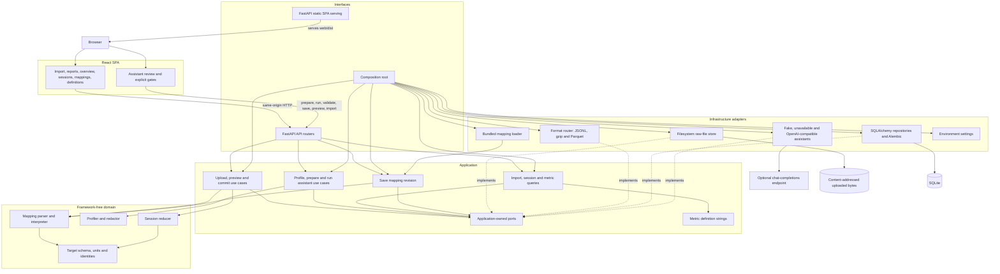
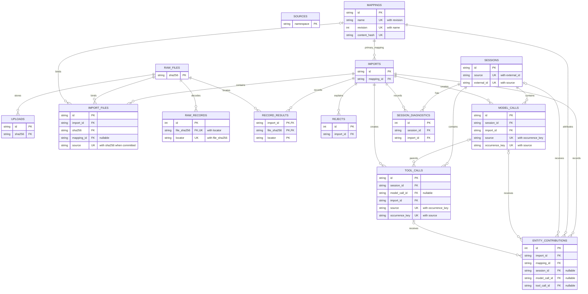

# System architecture and import pipeline

This page describes the implementation frozen at
`2a351e90bd67dc7fd51aa5a16b8cf27cbddb0dc2` on 2026-09-08. It follows the
running composition root, SQLAlchemy models and Alembic head rather than future
work in the release plan.

## Components and dependencies

The arrows show runtime calls or adapter wiring; the dotted arrows show port
implementation. Source dependencies still point inward: `domain` imports only
the standard library, `application` does not import infrastructure, and
`infrastructure` does not import interfaces. Import-linter checks those rules.
FastAPI mounts the built `web/dist` only when it exists and preserves `/api`
responses while falling back to `index.html` for client-side routes.

The assistant is optional. The fake adapter is deterministic and offline, the
OpenAI-compatible adapter can call a configured chat-completions endpoint, and
an unavailable adapter isolates missing or invalid configuration from uploads,
saved mappings, imports and dashboards.

## The import path

1. `POST /api/uploads` stores immutable bytes by SHA-256, sniffs JSONL, gzip or
   Parquet, counts records, retains a 20-record preview and reports earlier
   committed imports of the same bytes.
2. `POST /api/imports/preview` parses the selected mapping and runs the domain
   interpreter over up to the requested sample size without persisting output.
3. `POST /api/imports` accepts one file or a batch of at most 20, with a mapping
   revision bound to each file. Exact bytes already committed under the same
   source are recorded as duplicates. Remaining records are interpreted,
   session contributions are reduced once against existing state, and the
   attempt, file outcomes, observations, raw records, rejects, provenance and
   diagnostics are written in one transaction. A failure rolls that transaction
   back and retains a failed attempt report.
4. Query use cases read import outcomes, rejects, sessions, exact raw payload
   text and the four current summary metrics through the same unit-of-work
   boundary.

The assistant path is separate from canonicalisation. It profiles and redacts a
stored upload, shows the exact bounded context and digest, and passes that text
through the `MappingAssistant` port. The application parses and validates the
reply and can make one repair call. A proposal becomes executable data only
after an explicit validate and save; preview and import still use the same
deterministic mapping interpreter as any bundled revision.

## Persisted entities

The table set below matches `EXPECTED_TABLES` in
`backend/tests/infrastructure/test_database.py` and Alembic revision `0003`.
Attributes are intentionally bounded to primary keys, physical foreign keys and
uniqueness that carries identity or idempotency.

Constraints not fully expressible in the diagram:

- `mappings` is unique on `(name, revision)` and independently on
  `content_hash`.
- `sessions`, `model_calls`, `tool_calls` and `raw_records` are unique on
  `(source, external_id)`, `(source, occurrence_key)`,
  `(source, occurrence_key)` and `(file_sha256, locator)` respectively.
- `record_results` uses the composite primary key
  `(import_id, file_sha256, locator)`.
- The partial unique index on `import_files (sha256, source) WHERE committed =
  1` is the exact-file race guard. A nullable per-file `mapping_id` supports
  rows migrated from earlier schema states; current writes bind a mapping.
- Exactly one of `entity_contributions.session_id`, `model_call_id` and
  `tool_call_id` must be non-null. A tool call's `model_call_id` is optional.
- `source` columns are logical namespaces, not foreign keys to `sources`.
  Although the `sources` table exists, no repository currently reads or writes
  it; it is not a live source registry.
- The provenance `file_sha256` columns on rejects, model calls, tool calls and
  entity contributions are not physical foreign keys. The diagram draws only
  enforced relationships.

## Cross-file comparison (issue #33)

`domain/claims.py` freezes schema-v1 projections and prepares scoped native claims
from accepted emissions before reduction. Scope is source, harness, entity, session
and typed native-key values with an extraction fingerprint. Harness resolution uses
only original same-file session declarations, preferring an unambiguous declaration
in the same record. This intentionally follows ADR-002 rather than widening scope
to the reducer's current session storage key. Missing/ambiguous harness is one
file/rule condition with an affected-emission count; child-only files still create
implicit sessions. Scope/projection text above 64 KiB is similarly skipped.

`ClaimIndex` stores individual provenance in `entity_claims`, interns exact scope
text and exact projections, and indexes fixed SHA-256 projection digests. The
`claim_file_projections` table holds one deterministic witness per distinct
(scope, projection, file), with numeric-locator ordering inside a file. Exact
projection text is stored once per scoped digest and kept out of indexes.

All pending claims are staged before comparison. Each 128-row keyset page uses
one detection SELECT with three correlated index probes: equal projection in
another file and witnesses in lower/higher file-hash ranges. Equal probes skip
at most one own-file row; file-range probes exclude all own-file rows without
scanning them. A matching equal peer produces `matching_claim_equal_projection`;
a scoped peer with no equal peer produces `suspected_duplicate`. Neither code
changes observations, reduction, the five outcomes or entity insertion counts.

`TraceStoreResult` separates inserted entity counts from typed diagnostics.
`CommitImport` adds emission diagnostic counts to record warnings, sums records
into each file and files into the report, and persists file/rule conditions
separately. Claims, diagnostics, conditions, outcomes and final report commit
atomically. Exact replay supplies no candidates; earlier reports remain immutable.
GET report/history reconstructs the saved state; the diagnostics API supplies
paginated incoming/peer provenance without recomputation. Dedicated UI evidence
controls are deferred, and session detail has no new duplicate marker.

Migration `0005` follows `0004`. Its adapter uses reflected migration tables and
stored exact decoded records, with two paged interpreter passes per file: harness
declarations then verified emission claims. It never reruns reduction or rewrites
observations/metrics. Missing provenance or replay mismatch rolls back that file's
backfill savepoint, records `claim_backfill_unavailable`, and allows startup.
Historical warning snapshots stay unchanged and comparison version stays null;
recovered historical claims may serve as peers for newly checked imports.
Downgrade drops only the new comparison tables, supporting contribution index,
file warnings and comparison-version columns. The frozen contract and replay parity
tests must remain compatible with future interpreter changes.

## Current boundaries

The supported inputs, limits and intentionally excluded v0.1 capabilities are
kept in the [draft release notes](../releases/v0.1.0.md). Metric formulas and
comparability rules live in the [metric reference](../metrics/README.md); the
mapping contract lives in the [DSL reference](../mapping/README.md).
