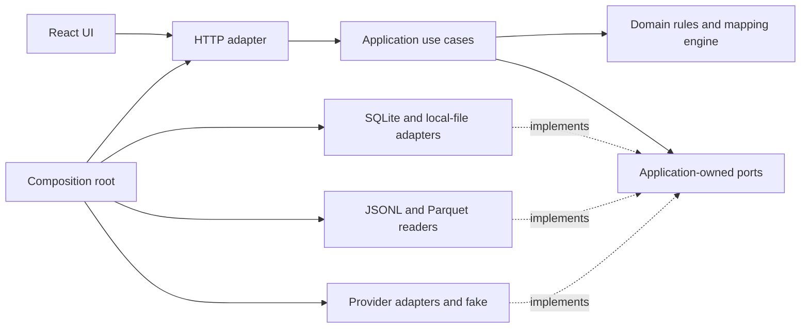

## 1. Reading of the brief

**AgentScope v0.1.0 should be a local-first web application with one reliable path: import → verify → normalise → explore.** Four days is enough for a deliberately bounded modular monolith, provided the mapping contract and data semantics are settled early.

From the [brief](/Users/sean/dev/AgentScope/_school/AgentScope_v2.md), with your overrides applied:

- **Project management starts first:** public GitHub repository, GitHub Project, task issues, labels, `v0.1.0` milestone, PR workflow and CI on every PR.
- **Ingestion:** upload one or more files, preview them, retain import history, support JSONL and at least one tabular format.
- **Real data:** start with the published TraceLab JSONL; document dataset revision, retrieval date, checksum and excerpt selection. Dashboard data must come from actual imports.
- **Normalisation:** distinguish sessions, model calls and tool calls; preserve relationships, original records and provenance; explain missing data, rejects and duplicates.
- **Idempotency:** importing the same file again must not increase dashboard totals.
- **Import assistant:** inspect a profile and filtered sample, explain proposed mappings, discuss ambiguities, accept corrections, preview and save reusable mappings.
- **Controlled execution:** the AI proposes configuration. A deterministic engine validates and applies it. No generated scripts or direct AI database writes.
- **Provider independence:** configurable provider, model and endpoint; isolated adapters; two distinct models exercised through the complete workflow; an offline test substitute.
- **Exploration:** at least four indicators, three visualisations, session details, source/agent/model/time filters, metric definitions, chart drill-down and visible data quality.
- **Clean Architecture:** domain and use cases independent of web, database, file-format and provider implementations.
- **Release:** reproducible installation, migrations, tests, example configuration, licence, contribution guide, architecture/data documentation, two source mappings, provider verification report, three reproducible numerical observations and a `v0.1.0` release.

The three requirements most likely to be under-delivered are:

1. **A genuinely reusable mapping engine.** TraceLab rows contain nested tools; other sources contain heterogeneous events. A flat field-renaming dictionary will fail.
2. **Correct accounting.** Missing values, token semantics and joins can produce plausible but false dashboards.
3. **Actual provider interchangeability.** A second configured model must complete analysis, correction, validation and import—not merely answer a connectivity check.

## 2. Stack propositions

| Option | Components | Advantages | Disadvantages | Clean Architecture fit | Four-day fit | LLM abstraction |
|---|---|---|---|---|---|---|
| **A. Python backend + React** | FastAPI, plain Python domain objects, SQLAlchemy/Alembic, SQLite, PyArrow; React/TypeScript, Vite, Recharts; pytest and Playwright | Strong ingestion tooling; suitable UI for mapping forms, preview tables and drill-down; clear parallel work boundaries | Two toolchains; API contract coordination; frontend build to package | Excellent if ORM and FastAPI types stay outside the core | **Good**, with three main screens and a frozen API contract | Python `MappingAssistant` protocol; separate HTTP adapters; provider responses converted to application-owned DTOs |
| **B. Full TypeScript** | Fastify, React/Vite, SQLite with Drizzle migrations, JSONL reader and Parquet library; Vitest and Playwright | One language; shared contracts; straightforward agent collaboration | Parquet integration needs early validation; coercion and numeric handling demand care; shared ORM types can leak everywhere | Excellent with framework-free domain modules and adapter boundaries | **Good if TypeScript is the developer’s strongest language** | TypeScript interface; each adapter handles its provider’s wire format and returns the same validated proposal |
| **C. Python-only UI** | Streamlit, plain Python application package, SQLAlchemy/Alembic, SQLite, PyArrow, Plotly; pytest and browser smoke tests | Fastest initial dashboard; one toolchain; minimal API work | Rerun/state behaviour complicates conversational editing, preview approval and navigation; harder to evolve into a conventional web product | Good only if Streamlit is a thin presentation layer | **Best for an internal tool**, less attractive for this product’s interactive import workflow | Same Python protocol as A; provider calls remain in application use cases, never embedded in page functions |

**Recommendation: A, Python + React, with SQLite and JSONL + Parquet.**

The difficult work is ingestion correctness and an interactive mapping workflow. Python handles the first naturally; React gives the second a durable foundation. FastAPI provides an OpenAPI contract that can anchor frontend/backend coordination. [FastAPI documentation](https://fastapi.tiangolo.com/features/)

Choose **Parquet instead of CSV** because SWE-chat publishes relational tables in Parquet and also exposes raw JSONL transcripts. This avoids adding a dataset conversion step merely to satisfy tabular support. [SWE-chat dataset documentation](https://huggingface.co/datasets/SALT-NLP/SWE-chat)

Keep deployment small:

- One backend process, SQLite database and local raw-file directory.
- Built React assets served by the backend.
- One application container and persistent volume; native development commands also documented.
- No database server, Redis or job broker.
- Pin dependency versions and commit both lockfiles on day 1.

Implement two provider adapters: **Anthropic Messages and Ollama native chat**, plus a fake. Verify model availability and local hardware on day 1; record exact tested model identifiers in configuration and the verification report. Ollama’s native chat API provides a separate integration surface, making this a useful portability exercise. [Ollama API documentation](https://docs.ollama.com/api/chat)

## 3. Architecture

**Use a modular monolith with dependencies pointing inward.**



| Layer | Responsibilities |
|---|---|
| **Domain** | Canonical entities, identifiers, units, validation, mapping AST, transformation interpreter, metric definitions and comparability rules |
| **Application** | Upload/profile, propose/revise mapping, validate/preview, commit import, list rejects/history, query dashboard and session details |
| **Presentation** | HTTP request/response translation; React upload wizard, mapping editor, dashboard and session drawer |
| **Infrastructure** | SQLAlchemy repositories, migrations, filesystem retention, JSONL/Parquet decoding, provider HTTP calls |
| **Composition root** | Load configuration and connect implementations to ports |

**Ports the core needs:**

- `RawFileStore`: retain immutable bytes and retrieve streams by content hash.
- `RecordReader`: decode a stream into records with reliable source locators.
- `ImportRepository`: attempts, mappings, per-record outcomes and rejects.
- `TraceRepository`: canonical entities and provenance.
- `UnitOfWork`: transactional persistence.
- `TraceQuery`: filtered facts and aggregates, using an application-owned query specification.
- `MappingAssistant`: propose or revise a mapping from sanitised context.
- `Clock` and `IdGenerator`: deterministic testing where needed.

Use narrow, task-oriented interfaces rather than a generic repository framework.

**Import flow:**

1. Store the upload and calculate its hash.
2. Read records, produce a bounded profile and preserve source locators.
3. Select a saved mapping or request an AI proposal.
4. Validate the mapping and run a preview.
5. Show transformations, missing fields, warnings and prospective rejects.
6. User confirms the exact file hashes and mapping revision.
7. Apply the same engine to all records; commit valid entities and outcomes transactionally.
8. Open the dashboard with an import filter.

Preview does not write canonical entities. Editing the mapping invalidates its previous preview and approval.

**The import assistant is a bounded workflow.** The application can provide field profiles, filtered samples and preview diagnostics. The model can return explanations, questions and a revised mapping. It has no filesystem, shell, SQL or database-write capability.

Enforce “no free code execution” through all of these controls:

- Parse mappings into a closed, versioned AST.
- Reject unknown operators, target fields and parameters.
- Allow only predefined transformations and bounded collection traversal.
- Provide no expression language, `eval`, generated SQL, templates or plugins in mappings.
- Limit input size, nesting, array expansion and proposal retries.
- Revalidate mappings server-side, regardless of provider-side structured output.
- Treat trace text as untrusted data; escape it when displayed.
- Send field profiles by default. Free-text samples require filtering and an explicit UI preview before transmission.

Metric definitions belong to the core. Optimised SQL belongs to the query adapter and must be checked against small reference calculations.

## 4. Data model

Use application-generated primary keys, explicit foreign keys and database uniqueness constraints. Enable SQLite foreign-key enforcement on **every connection**. [SQLite foreign-key documentation](https://sqlite.org/foreignkeys.html)

| Table | Meaning of one row | Important fields and relationships |
|---|---|---|
| `sources` | One dataset identity namespace | `id` PK, unique `namespace`, name, upstream URL; defines where native IDs are unique |
| `raw_files` | One immutable uploaded byte sequence | `id` PK, unique SHA-256, byte size, storage key |
| `imports` | One user import attempt, possibly containing several files | `id` PK, `source_id` FK, timestamps, status, summary snapshot |
| `import_files` | One file’s participation in an attempt | `id` PK, `import_id` FK, `raw_file_id` FK, `mapping_id` FK, original filename, format, dataset revision/retrieval/selection metadata |
| `raw_records` | One decoded JSONL record or Parquet row | `id` PK, `raw_file_id` FK, locator, payload; unique `(raw_file_id, locator)` |
| `mappings` | One immutable revision of a mapping | `id` PK, logical mapping key, revision, DSL/schema versions, contract JSON, hash, parent revision, approval state, proposal metadata |
| `record_results` | One raw record’s outcome in one import-file execution | Composite key `(import_file_id, raw_record_id)`; accepted/partial/duplicate/rejected/ignored, entity counts and missing-field summary |
| `sessions` | One observed coding-agent session | `id` PK, `source_id` FK, identity key, native ID, agent, nullable observed start/end; unique `(source_id, identity_key)` |
| `model_calls` | One identifiable model invocation | `id` PK, `session_id` FK, identity key, nullable provider/model/times, token fields and accounting semantics; unique `(session_id, identity_key)` |
| `tool_calls` | One tool invocation, optionally linked to its invoking model call | `id` PK, `session_id` FK, nullable `model_call_id` FK, identity key, tool name, timestamps, separate duration fields, nullable error state |
| `provenance` | One source-record contribution to one canonical entity | Raw record and import-file FKs, rule/path, and exactly one typed session/model-call/tool-call FK |
| `rejects` | One explained failed record or entity emission | `id` PK, record-result FK, rule, target field/path, error code and readable explanation |

For provenance, use checked typed foreign keys rather than an unconstrained `entity_type/entity_id` pair.

**Relationship rules:**

- A session contains many model calls and tool calls.
- A model call may contain many tool calls.
- A tool call can exist without a known model-call relationship; keep that relationship null.
- If a tool references a model call, both must belong to the same session.
- One raw record may produce a session contribution, one model call and several tool calls.
- Several raw records may contribute complementary fields to the same identified invocation.
- Missing parents become explained rejects unless the mapping explicitly supplies enough information to establish the session.
- A conversation message is not automatically a model invocation. Unsupported invocation reconstruction stays missing.

TraceLab specifically publishes one model invocation per JSONL row with nested tool metadata. Its token and latency fields have distinct meanings that must survive normalisation. [TraceLab data format](https://github.com/uw-syfi/TraceLab#-data-format)

**Units and nulls:**

- Timestamps: UTC, retaining original representation in raw data.
- Durations: integer milliseconds; wall time and runner-reported time remain separate.
- Tokens: non-negative integers or null, with explicit accounting semantics.
- Unknown booleans remain null.
- An observed session span is not labelled “active working time.”
- Session-level reported totals are not copied into synthetic model calls.

**Deliberate departures from strict normalisation:**

- Raw payloads and mapping contracts remain JSON because they are immutable source/configuration documents.
- Import summaries and missing-field summaries are audit snapshots; they do not drive dashboard totals.
- `tool_calls.session_id` is redundant when `model_call_id` exists, but supports tools whose invoking call is unknown. Enforce consistency with a composite relationship.
- Observed session bounds may be cached from accepted events, with the derivation documented.
- Start with query views rather than materialised dashboard tables.

**Idempotent re-import strategy:**

1. Hash the bytes; reuse raw storage independently of filename.
2. For a previously committed file in the same source namespace with the same reader options and mapping contract, record a duplicate attempt without inserting canonical rows.
3. Deduplicate overlapping files using native entity identities scoped by source/session.
4. When native event IDs are absent, use a documented file-hash + record-locator + emission-path fallback. This guarantees exact-file idempotency, but cannot promise deduplication across repackaged exports.
5. Merge only complementary null/non-null values. Conflicting non-null facts produce a conflict diagnostic; never silently use “last writer wins.”
6. Enforce uniqueness and commit valid entities, lineage and outcomes in one transaction. A process failure cannot leave half an import visible.

For v0.1.0, **changing the mapping of already committed data supports preview but not automatic replacement**. Explain that limitation in the UI. Saved edits apply to future imports; bulk reprocessing is deferred.

Report **record outcomes and entity outcomes separately**: one input record may produce several entities, so a single “rows imported” number is misleading.

## 5. Mapping DSL

**The durable artifact is a declarative mapping contract, independent of its proposing model.**

| Contract part | Required content |
|---|---|
| Identity | Logical mapping ID, immutable revision, parent revision and content hash |
| Compatibility | `dsl_version`, `target_schema_version`, minimum compatible engine version |
| Input | JSONL/Parquet, reader options, expected structural fingerprint and required fields |
| Context | Explicit file-level constants or bounded header-field extraction, where needed |
| Rules | Rule ID, bounded record predicate, collection selector and target entity |
| Identity and links | Native/composite identity fields; references to session and optional parent invocation |
| Field mappings | Source path or literal → target field, followed by ordered allowlisted transformations |
| Units | Explicit source unit and canonical target unit; timezone or epoch unit when applicable |
| Missing/error policy | Required, nullable, approved constant default, warning or reject |
| Merge policy | Same-identity equality/complementary-field merge; conflict behaviour |
| Documentation | Explanation, unresolved ambiguities, sample evidence and unsupported structures |

A field mapping should express, for example:

> `record.tools[*].tool_wall_latency_ms` → `tool_call.wall_duration_ms`; strict integer conversion; source unit milliseconds; preserve null; reject negative values.

**Allowed capabilities:**

- Object-key and array-index access; bounded iteration over named arrays.
- Relative access to the current item and its enclosing record.
- Predicates limited to existence, equality and membership.
- Trim, explicit enum/boolean mapping, strict integer/decimal parsing.
- Explicit timestamp parsing and unit conversion.
- Ordered coalescing, approved constants and composite identity construction.
- Bounded JSON decoding for a field that contains serialized JSON.
- Entity references resolved by declared keys; complementary events merged only by explicit identity.

**Excluded capabilities:** arbitrary expressions, regex programs, recursive descent, general joins, fuzzy matching, inferred adjacency relationships and arbitrary aggregation.

For each field, distinguish:

- Absent key.
- Explicit null.
- Empty text.
- Failed conversion.

These may map to the same canonical null only when the contract explicitly says so. Never default missing tokens or durations to zero.

**Validation has four stages:**

1. Contract schema validation.
2. Semantic validation: target fields, types, units, keys and references.
3. Preview execution with diagnostics.
4. Full execution validation on every record.

A provider change affects proposal generation only. Store provider/model/prompt-version metadata for audit, outside executable mapping semantics. Previously approved mappings must replay with **no LLM call**.

Unknown DSL major versions fail clearly. Mapping edits create revisions rather than mutating historical imports.

## 6. Day-by-day plan

Treat this as approximately **32 human working hours**, with AI agents implementing bounded tasks in parallel. Reserve integration time every day.

| Day | Ordered work | Concrete demo and completion gate |
|---|---|---|
| **1 — Establish the project and thin slice** | **Step 1: create the GitHub repo and Project using `gh`; configure board, issues, labels and milestone.** Establish PR protection and CI. Inspect small real excerpts from all three sources, reserve an unseen sample, settle identities and DSL v1. Verify access to two models. Implement JSONL reading, immutable raw retention, the initial migration and a declarative TraceLab mapping. Build upload → preview → confirm → import summary → one indicator → session detail. | Import a real TraceLab excerpt in the browser, inspect its source record, see a computed indicator, restart and retain the data, then re-import with unchanged totals. No LLM required for this saved-mapping path. |
| **2 — Make ingestion and analytics trustworthy** | Add Parquet, multiple-file imports, heterogeneous record routing, bounded array expansion, key-based reconciliation, rejects and history. Finish filters, metric definitions and provenance links. Add four indicators and three charts. Test joins, nulls, units and import failure recovery. | Import JSONL and Parquet; explain a partial import; click a chart to reach sessions and source records. Deliberately overlapping files do not inflate identified events. |
| **3 — Add assisted mapping and a second source** | Implement sanitised profiling, proposal/revision conversation, editable mapping form, validation and preview. Complete two provider adapters and the fake. Import a SWE-chat excerpt through UI configuration. Save and reuse its mapping. Run the same unknown-file workflow with both model configurations. Freeze features at day’s end. | Both models support proposal → correction → preview → commit. Saved mappings work after switching providers and with provider access disabled. Two distinct source mappings are documented. |
| **4 — Verify, package and release** | Import the reserved Trace Commons sample with the frozen engine; correct mappings only through the UI. Exercise failure paths. Perform a clean-clone installation rehearsal. Complete documentation, provider verification evidence and three numerical observations. Fix release blockers, rerun CI and publish `v0.1.0`. | An external user can install, import, inspect quality and explore. An unfamiliar supported structure imports wholly or partially with explained limitations and no code changes. Release references the verified commit. |

SWE-chat’s raw transcripts and relational tables provide a useful second structure. Reserve a native JSONL trace from Trace Commons for day 4; its source files preserve agent-specific formats. [SWE-chat](https://huggingface.co/datasets/SALT-NLP/SWE-chat), [Trace Commons](https://huggingface.co/datasets/trace-commons/agent-traces)

**Dashboard scope:**

| Item | Definition |
|---|---|
| Session count | Distinct sessions in the selected scope |
| Model-call count | Identified model invocations matching filters |
| Input tokens | Sum of known canonical input totals; show contributing-call coverage and separate incompatible semantics |
| Output tokens | Sum of known output tokens; show contributing-call coverage |

When no contributing value is known, token indicators show **Unavailable**, not zero.

Three charts:

- Model-call activity by day, with unknown timestamps reported separately.
- Token usage by model, separated when accounting is incompatible.
- Tool invocation counts by tool name, with an explicit unknown-name category.

Every chart links to the corresponding filtered records. A quality strip shows rejects, missing usage, unknown timestamps and unlinked tools. Define model/time filters at call level; tool calls with unknown parent model cannot silently enter a model-filtered result.

**Parallel-agent working agreement:**

- Human owns architecture, shared contracts, migrations and integration.
- Claude Code and Codex receive separate issue branches/worktrees and bounded file ownership.
- Freeze API and mapping contracts before splitting backend/frontend work.
- Changes to shared contracts go through the human integrator.
- PRs stay small; the other agent can inspect the diff, followed by human review.
- No fictitious second human approval requirement.
- Integrate at midday and end of day. Agent throughput does not replace these checkpoints.

## 7. GitHub setup

**These are execution instructions for the sprint; no repository or Project is created as part of this plan.**

**Step 1 — Create the repository and Project.**

Assume personal-account ownership and an authenticated `gh` installation:

```bash
gh auth status
gh auth refresh -s project

AGS_OWNER="$(gh api user --jq .login)"
AGS_REPO="$AGS_OWNER/AgentScope"

gh repo create "$AGS_REPO" \
  --public \
  --add-readme \
  --license mit \
  --description "Import, normalise and explore AI coding-agent traces"

AGS_PROJECT_NUMBER="$(gh project create \
  --owner "$AGS_OWNER" \
  --title "AgentScope v0.1.0" \
  --format json \
  --jq .number)"

gh project edit "$AGS_PROJECT_NUMBER" \
  --owner "$AGS_OWNER" \
  --visibility PUBLIC

gh project link "$AGS_PROJECT_NUMBER" \
  --owner "$AGS_OWNER" \
  --repo "$AGS_REPO"

gh project view "$AGS_PROJECT_NUMBER" \
  --owner "$AGS_OWNER" \
  --web
```

The CLI supports repository creation, Project creation, visibility changes and repository linking. [Repository creation](https://cli.github.com/manual/gh_repo_create), [Project creation](https://cli.github.com/manual/gh_project_create), [Project editing](https://cli.github.com/manual/gh_project_edit), [Project linking](https://cli.github.com/manual/gh_project_link)

In the Project UI:

1. Edit the existing **Status** field to exactly: **Todo / In progress / In review / Done**.
2. Create a Board view grouped by Status and save it.
3. Display assignee, labels and milestone on cards.
4. Configure newly added items as Todo and closed issues as Done.
5. Move an issue to In review when its implementation PR is ready; Done requires its verifiable result.

Use the existing Status field rather than creating a competing workflow field. [GitHub board configuration](https://docs.github.com/en/issues/planning-and-tracking-with-projects/customizing-views-in-your-project/customizing-the-board-layout)

**Labels and milestone:**

```bash
for AGS_LABEL in day:1 day:2 day:3 day:4
do
  gh label create "$AGS_LABEL" \
    --repo "$AGS_REPO" --color 1D76DB --force
done

for AGS_LABEL in area:core area:import area:ui area:llm area:delivery
do
  gh label create "$AGS_LABEL" \
    --repo "$AGS_REPO" --color 5319E7 --force
done

gh label create release-blocker \
  --repo "$AGS_REPO" --color B60205 --force

gh api --method POST "repos/$AGS_REPO/milestones" \
  -f title="v0.1.0" \
  -f description="Four-day release: import, verify, normalise, explore"
```

Set the milestone due date to the agreed fourth working day in GitHub.

**Initial issues — create all during setup.**

Each issue is assigned to the developer, placed on the Project and attached to `v0.1.0`. The identifiers below are planning identifiers, not predicted GitHub issue numbers.

| Day | Title | Expected verifiable result |
|---|---|---|
| 1 | **D1-01 Establish repository, board and PR checks** | Public board contains all issues; a PR runs CI; main requires passing checks. |
| 1 | **D1-02 Freeze canonical model, DSL and source fixtures** | ADRs define identities/nulls/units; real excerpts have manifests; both chosen models are accessible. |
| 1 | **D1-03 Implement TraceLab import thin slice** | JSONL produces linked sessions, model calls and tools with raw provenance; exact re-import adds nothing. |
| 1 | **D1-04 Deliver browser import-to-session path** | Upload, preview, confirm, computed indicator and session/source-record inspection work after restart. |
| 2 | **D2-01 Add Parquet and bounded mapping operations** | Real Parquet rows and nested/typed JSONL records pass through the same engine. |
| 2 | **D2-02 Complete import accounting and recovery** | History exposes record/entity outcomes; overlap, conflicts and interrupted commits have tested behaviour. |
| 2 | **D2-03 Deliver dashboard and drill-down** | Four indicators, three charts, filters, definitions and quality information use imported data. |
| 2 | **D2-04 Verify metric and relationship correctness** | Tests catch join multiplication, missing-as-zero errors, unit mistakes and cross-session links. |
| 3 | **D3-01 Implement provider-neutral mapping assistance** | Two adapters and a fake return one contract; malformed and truncated responses fail clearly. |
| 3 | **D3-02 Deliver mapping conversation and editor** | A user can discuss, edit, preview, approve, save and reuse a mapping entirely in the UI. |
| 3 | **D3-03 Import SWE-chat and verify both models** | Second-source mapping and two complete model-run reports exist; replay needs no LLM. |
| 4 | **D4-01 Exercise unseen structures and failure paths** | Reserved trace imports through configuration; unsupported records and unsafe proposals are explained. |
| 4 | **D4-02 Complete installation and project documentation** | Clean-clone rehearsal succeeds; architecture, ERD, metrics, source manifests and contribution guide are complete. |
| 4 | **D4-03 Publish observations and v0.1.0** | Three findings are reproducible; release points to the tested commit and documents limitations. |

For each row, use this command pattern, replacing the title, result and labels:

```bash
AGS_ISSUE_URL="$(gh issue create \
  --repo "$AGS_REPO" \
  --title "D1-01 Establish repository, board and PR checks" \
  --body "Expected result: Public board contains all issues; a PR runs CI; main requires passing checks." \
  --assignee "$AGS_OWNER" \
  --milestone "v0.1.0" \
  --label "day:1,area:delivery")"

gh project item-add "$AGS_PROJECT_NUMBER" \
  --owner "$AGS_OWNER" \
  --url "$AGS_ISSUE_URL"
```

Use `--body-file` for longer acceptance criteria and dependency notes. [GitHub issue creation](https://cli.github.com/manual/gh_issue_create)

**Branch protection.**

After repository creation, ensure the default branch is named `main`. Enable squash merging:

```bash
gh repo edit "$AGS_REPO" \
  --enable-squash-merge \
  --enable-merge-commit=false \
  --enable-rebase-merge=false \
  --delete-branch-on-merge
```

Require PRs and the exact CI job name `ci-required`, with zero mandatory external approvals:

```bash
gh api --method PUT "repos/$AGS_REPO/branches/main/protection" \
  --input - <<'JSON'
{
  "required_status_checks": {
    "strict": true,
    "contexts": ["ci-required"]
  },
  "enforce_admins": true,
  "required_pull_request_reviews": {
    "required_approving_review_count": 0,
    "require_code_owner_reviews": false,
    "require_last_push_approval": false
  },
  "restrictions": null,
  "required_linear_history": true,
  "allow_force_pushes": false,
  "allow_deletions": false,
  "required_conversation_resolution": true
}
JSON
```

The first PR must introduce the workflow so its required check can run. Repository-generated README/licence files are the bootstrap; subsequent changes use PRs. GitHub explicitly permits a required approval count of zero. [Branch-protection API](https://docs.github.com/en/rest/branches/branch-protection)

**CI workflow specification — implement in `.github/workflows/ci.yml`:**

- Trigger on every `pull_request`, pushes to `main`, and manual dispatch.
- No path filters that could omit the required check.
- Read-only repository permissions; no provider secrets.
- Pin runtime versions and action revisions.
- Install Python and frontend dependencies from committed lockfiles.
- Run formatting/linting, Python and TypeScript checks.
- Run domain tests and SQLite integration tests against a migrated temporary database.
- Build the frontend.
- Run a Playwright import → preview → commit → dashboard → re-import test with the fake provider.
- Include a migration-from-empty check and architecture import-boundary check.
- Finish with `ci-required`, which runs even after upstream failures and succeeds only when every required job passed.

Important regression fixtures include one model call with multiple tools, missing versus zero usage, overlapping files, conflicting identities, malformed mappings and injected instructions inside trace text.

Each PR references its issue with `Closes #…`, includes validation evidence and updates the board. Verify checks before squash merge.

**Release steps:**

1. Merge the final release PR.
2. Confirm CI passed on the exact main commit.
3. Rehearse installation from that commit.
4. Record its SHA and publish:

```bash
AGS_RELEASE_SHA="$(gh api \
  "repos/$AGS_REPO/commits/main" --jq .sha)"

gh release create v0.1.0 \
  --repo "$AGS_REPO" \
  --target "$AGS_RELEASE_SHA" \
  --title "AgentScope v0.1.0" \
  --notes-file docs/releases/v0.1.0.md
```

Close the milestone after the release acceptance criteria pass.

## 8. Risks and open questions

| Risk or question | Decide now | Defer |
|---|---|---|
| **Source structure exceeds DSL capability** | Inspect representative structures on day 1; support bounded arrays, event routing and explicit identity reconciliation. Explain unsupported records. | Universal trace reconstruction and arbitrary joins |
| **Messages mistaken for invocations** | Require evidence of invocation identity/grain; preserve unsupported records without inventing calls. | Heuristic request reconstruction |
| **Incorrect cross-source metrics** | Preserve accounting semantics and coverage; separate incompatible values; test join multiplication. | Universal cost and cache-efficiency comparison |
| **Idempotency without stable IDs** | Guarantee exact-file replay; use native keys where present; document fallback limits. | Fuzzy cross-export deduplication |
| **Two-model verification fails late** | Confirm credentials, model availability and Ollama performance on day 1. If local execution is unsuitable, select a second remote-provider adapter that day. | Benchmarking many models |
| **Sensitive data reaches a provider** | Profiles first; bounded, filtered samples; visible outgoing payload; keys only on the backend. Keep raw uploads out of Git. | A comprehensive automated anonymisation system |
| **Large files exhaust time or memory** | Initial product limits: 25 MiB per file, 100,000 records per batch and bounded record/array sizes; reject oversize inputs clearly. Benchmark the supported envelope. | Distributed ingestion, resumable jobs and multi-GB files |
| **Parallel agents create integration debt** | Human-owned contracts and migrations, separate worktrees, small PRs and twice-daily integration. | Elaborate agent orchestration |
| **Dataset publication rights are unclear** | Ship retrieval references and manifests by default; include excerpts only after checking their redistribution terms. | Bundling entire datasets |
| **Four days is insufficient** | Cut polish and optional analyses first. Preserve import correctness, two formats, two source mappings, two-model evidence and the release rehearsal. | All additional product features |

Also decide immediately:

- **Deployment:** local, single-user application bound to loopback by default.
- **Import processing:** one active commit at a time; bounded synchronous processing.
- **Source namespace:** user confirms which dataset/source an upload belongs to.
- **Mapping corrections:** revisions are supported; replacing committed normalisation is deferred.
- **Dates:** define the actual fourth working day instead of assuming the brief’s Friday deadline.
- **Observations:** select three questions on day 2, but calculate and publish their answers only from verified imports, with hashes, mappings and filters.

## 9. What I would explicitly NOT build in v0.1.0

- Authentication, organisations, multi-tenancy or public hosted deployment.
- Microservices, queues, Redis or a separate analytical database.
- Direct Hugging Face integration, URL imports or dataset crawling.
- CSV support alongside the selected JSONL and Parquet formats.
- An autonomous coding agent, generated connectors or executable mapping scripts.
- Universal recognition of every native agent trace.
- Cross-dataset identity resolution or heuristic model-call reconstruction.
- Bulk reprocessing/version replacement of already committed imports.
- Cost estimates without verified pricing and compatible usage semantics.
- Anomaly detection, forecasting, natural-language dashboard questions or vector search.
- Full transcript search, replay and repository browsing.
- A visual node-based mapping designer; use a field table, bounded selectors and validation errors.
- A plugin marketplace or provider framework.
- A second human reviewer requirement, grading artefacts or school-oriented process theatre.
